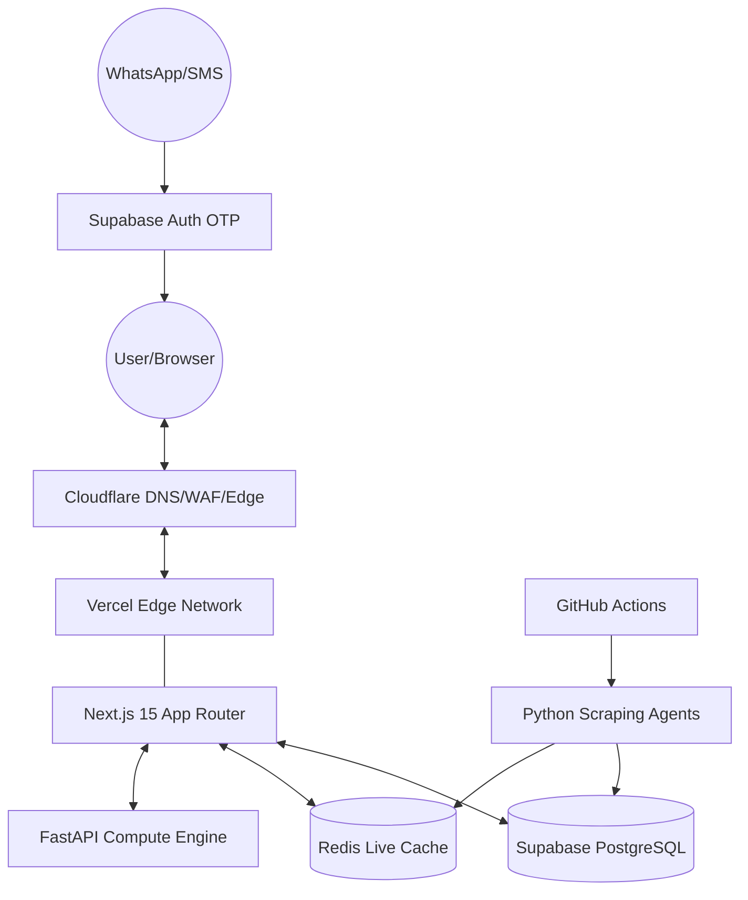

# System Architecture Document: Telangana.live 2.0

## 1. Executive Summary
Telangana.live 2.0 is a hyper-local, AI-driven information portal designed to provide real-time updates and localized dashboards for every Ward and Mandal in Telangana. The architecture transitions from a client-side Vite application to a robust, server-first Next.js 15 environment, leveraging a hybrid backend for both web logic and heavy-duty AI/scraping tasks.

## 2. High-Level Architecture Diagram

## 3. Component Details

### 3.1 Frontend: Next.js 15 (App Router)
- **Framework**: Next.js 15 with React 19.
- **Rendering Strategy**:
  - **Server Components (RSC)**: Default for all data-fetching components to minimize client bundle size.
  - **Static Site Generation (SSG)**: For high-traffic, low-change pages (e.g., District landing pages).
  - **Incremental Static Regeneration (ISR)**: For Mandal/Ward dashboards, refreshing every 15-60 minutes.
- **Styling**: Tailwind CSS for high-performance, utility-first UI.
- **State Management**: React Server State + URL params for filter persistence.

### 3.2 Backend: Hybrid Strategy
- **Next.js API Routes**:
  - Primary API Gateway.
  - Handles Auth, standard CRUD, and lightweight business logic.
  - Proxies complex requests to the FastAPI engine.
- **FastAPI (Compute-Heavy)**:
  - **AI Processing**: LLM orchestration for content generation and summarization.
  - **Data Processing**: Complex aggregations of scraping results.
  - **Image Processing**: Dynamic generation of social share cards.

### 3.3 Database Layer: Supabase & Redis
- **PostgreSQL (Supabase)**:
  - Primary source of truth.
  - Uses **Row Level Security (RLS)** for multi-tenant data isolation by District/Mandal.
  - PostGIS extension for spatial queries (Ward mapping).
- **Redis (Upstash/Managed)**:
  - **Live Data Cache**: Stores real-time prices (Gold, Fuel, Vegetables).
  - **Rate Limiting**: Protects API routes.
  - **Session Cache**: For transient user state.

### 3.4 Ingestion Pipeline
- **Orchestration**: GitHub Actions triggers daily/hourly scheduled runs.
- **Execution**: Python Agents running in Docker containers (via GitHub Actions Runners or AWS Fargate).
- **Flow**:
  1. Trigger -> 2. Scrape (FastAPI/Python) -> 3. Clean/Normalize -> 4. Upsert to Supabase.

### 3.5 Authentication & User Management
- **Provider**: Supabase Auth.
- **Methods**:
  - **Passwordless OTP**: via WhatsApp/SMS (Twilio/MessageBird integration).
  - **Social Login**: Google/Apple for wider reach.
- **Security**: JWT-based authorization verified at the Edge (Vercel Middleware).

## 4. Caching & Performance
- **Edge Caching**: Vercel Data Cache for fetching Supabase records.
- **Global CDN**: Cloudflare for static asset delivery and DDoS protection.
- **Prefetching**: Next.js Link prefetching for instant page transitions.

## 5. Scalability & Security
- **Multi-tenancy**: Strictly enforced via Postgres RLS. Users are isolated based on their `district_id` or `mandal_id`.
- **API Gateway**: Next.js serves as a unified entry point, abstracting the internal service topology.
- **Deployment**:
  - **Frontend/API**: Vercel (Auto-scaling).
  - **Compute Engine**: Dockerized FastAPI on AWS/GCP or Vercel Functions.
  - **DNS**: Cloudflare for low-latency routing.

## 6. Implementation Milestones
1. **Migration Phase**: Transition current Vite logic to Next.js App Router.
2. **Gateway Phase**: Implement Next.js API routes as a proxy to existing Python logic.
3. **Hyper-local Phase**: Deploy Ward/Mandal schema and RLS policies.
4. **Optimization Phase**: Integrate Redis caching and Edge Middleware.
