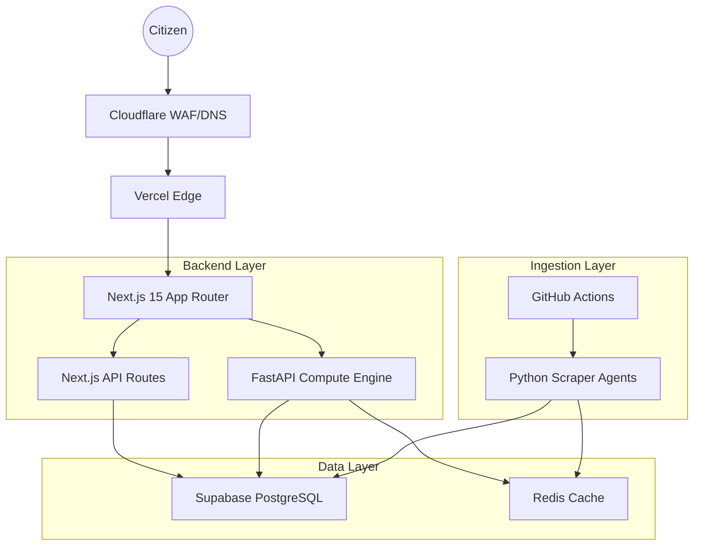
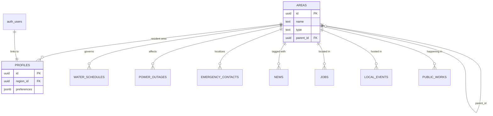

# Telangana.live 2.0: Technical Foundation & Blueprint

This document provides the complete technical foundation for the improved Telangana.live platform. It is a consolidated output from a coordinated team of autonomous expert agents.

---

## 1. System Architecture
*Refer to docs/SYSTEM_ARCHITECTURE_2_0.md for full details.*

### High-Level Architecture


### Tech Stack
- **Frontend**: Next.js 15 (App Router, Server Components), TypeScript, Tailwind CSS, Framer Motion (Glassmorphism).
- **Backend**: Hybrid (Next.js API routes for web logic, FastAPI for AI/scraping).
- **Database**: Supabase PostgreSQL + PostGIS.
- **Cache**: Redis for real-time rates/weather.
- **AI**: Gemini 1.5 Flash for news classification and RAG-based assistant.
- **Auth**: Supabase Auth (OTP/WhatsApp focused).
- **Deployment**: Vercel (Web/API), Docker (Compute Agents), Fly.io/Railway.

---

## 2. Database Schema + ERD
*Refer to Section 2 in the design report.*

### ERD (Mermaid)


### Key Tables (SQL)
```sql
CREATE TABLE public.areas (
    id UUID PRIMARY KEY DEFAULT uuid_generate_v4(),
    name TEXT NOT NULL,
    type TEXT NOT NULL CHECK (type IN ('district', 'mandal', 'ward', 'village')),
    parent_id UUID REFERENCES public.areas(id)
);

CREATE TABLE public.news (
    id UUID PRIMARY KEY DEFAULT uuid_generate_v4(),
    region_id UUID REFERENCES public.areas(id),
    category TEXT NOT NULL,
    title TEXT NOT NULL,
    content TEXT,
    ai_score NUMERIC DEFAULT 0,
    published_at TIMESTAMPTZ DEFAULT NOW()
);
```

---

## 3. UI Wireframes
*Refer to docs/WIREFRAMES_2_0.md for full details.*

### Home Dashboard (Personalized)
```text
+---------------------------------------------+
| [O] Profile    THE PULSE    [!] Emergency   |
+---------------------------------------------+
| [!] HEAVY RAIN ALERT: GHMC AREA (Click)     |
+---------------------------------------------+
| MY AREA: Jubilee Hills, Ward 95 [v]         |
+---------------------------------------------+
| LIVE RATES: Gold 7,200 | Petrol 109.6 | ... |
+---------------------------------------------+
| UTILITY SNAPSHOT:                           |
| +-------------------+ +-------------------+ |
| | 💧 Water: 4:00 PM | | ⚡ Power: Normal | |
| +-------------------+ +-------------------+ |
+---------------------------------------------+
| HYPERLOCAL NEWS:                            |
| +-----------------------------------------+ |
| | [New Park in Ward 95] | AI Score: 95%   | |
| +-----------------------------------------+ |
+---------------------------------------------+
| [Home] [Area] [SOS] [Jobs] [Schemes]        |
+---------------------------------------------+
```

---

## 4. Feature-by-Feature Technical Plan

| Feature | Purpose | Data Source | Caching |
|---|---|---|---|
| **My Area** | Localized context | `profiles.region_id` | Session + Redis |
| **Water Updates** | Dynamic scheduling | HMWSSB API/Scraper | Redis (1h TTL) |
| **SOS Directory** | Geo-aware emergency | `emergency_contacts` | Edge Cached |
| **Schemes Finder** | Eligibility logic | `government_schemes` | Stale-While-Revalidate |
| **AI Assistant** | RAG-based citizen help | Gemini Flash + DB | No (Real-time) |
| **Public Works** | Transparency | `public_works` | Daily Sync |

---

## 5. Project Folder Structure + Code Stubs

### Structure
```text
telangana-live-v2/
├── frontend/ (Next.js 15)
├── backend/ (FastAPI)
├── supabase/ (Migrations)
└── scripts/ (Ingestion)
```

### Backend Stub (`main.py`)
```python
from fastapi import FastAPI
app = FastAPI(title="Telangana.live 2.0")

@app.get("/api/v2/civic/water")
async def get_water(area_id: str):
    return {"status": "Supplying", "eta": "2h"}
```

### Frontend Layout (`layout.tsx`)
```tsx
export default function Layout({ children }) {
  return (
    <div className="glass-bg min-h-screen text-white">
      <main className="container mx-auto p-4">{children}</main>
    </div>
  );
}
```

---
**Deployment Readiness: High.**
This foundation is architected for the Next.js migration and 33-district scale required for Telangana.live 2.0.
