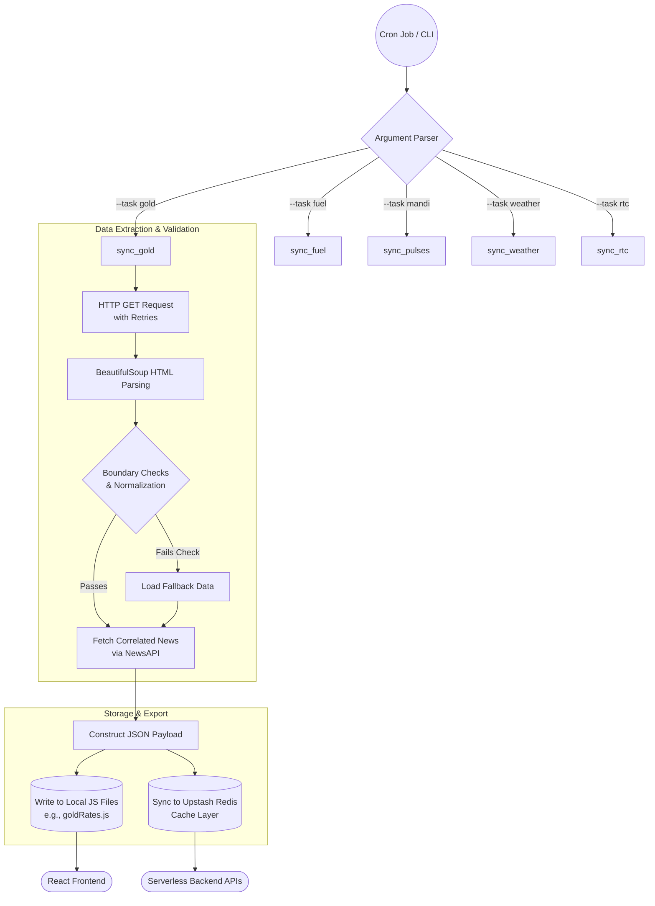

# Data Engine Scraping Flow

This diagram illustrates how the Python `data_engine.py` script pulls data from live sources, validates it, and writes it to both the frontend codebase and the backend cache.

