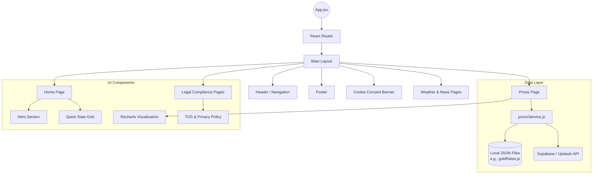

# Frontend Component Architecture

This diagram maps out the structure of the React frontend, including the component hierarchy, routing, and data fetching layers.

```mermaid
flowchart TD
    App((App.jsx)) --> Router[React Router]
    
    Router --> Layout[Main Layout]
    
    Layout --> Navbar[Header / Navigation]
    Layout --> Footer[Footer]
    Layout --> CookieConsent[Cookie Consent Banner]
    
    Layout --> Page1[Home Page]
    Layout --> Page2[Prices Page]
    Layout --> Page3[Weather & News Pages]
    Layout --> Page4[Legal Compliance Pages]
    
    subgraph Data Layer
        Page2 --> PricesService[pricesService.js]
        PricesService --> LocalData[(Local JSON Files\ne.g., goldRates.js)]
        PricesService --> API(Supabase / Upstash API)
    end
    
    subgraph UI Components
        Page1 --> Hero[Hero Section]
        Page1 --> QuickStats[Quick Stats Grid]
        Page2 --> Charts[Recharts Visualization]
        Page4 --> Tos[TOS & Privacy Policy]
    end
```
