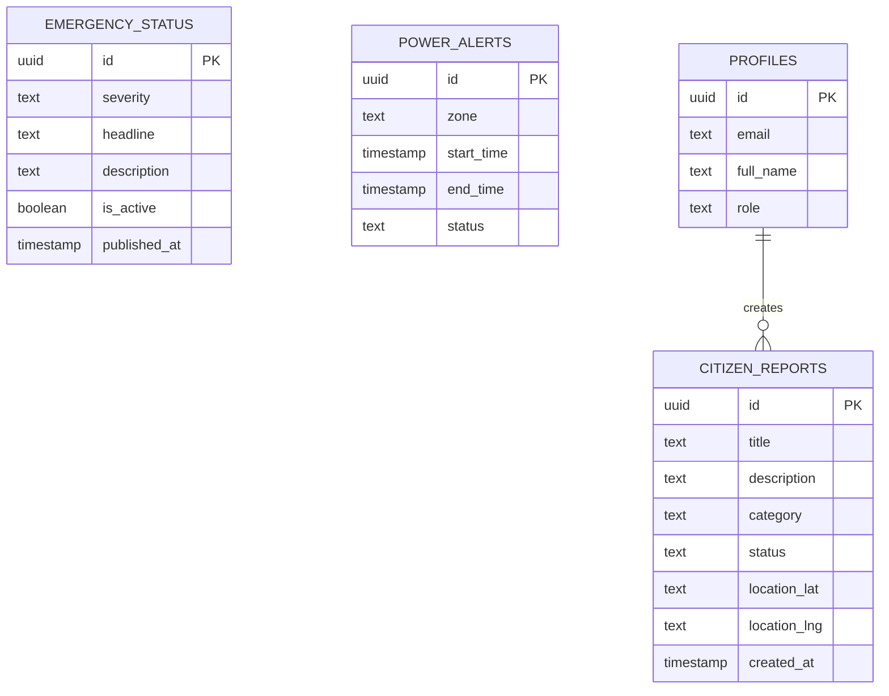

# Supabase Database Schema

This diagram models the Postgres tables created in the Supabase backend to support dynamic civic features (citizen reporting, emergency alerts, etc.).

```mermaid
erDiagram
    CITIZEN_REPORTS {
        uuid id PK
        text title
        text description
        text category
        text status
        text location_lat
        text location_lng
        timestamp created_at
    }
    
    EMERGENCY_STATUS {
        uuid id PK
        text severity
        text headline
        text description
        boolean is_active
        timestamp published_at
    }
    
    POWER_ALERTS {
        uuid id PK
        text zone
        timestamp start_time
        timestamp end_time
        text status
    }
    
    PROFILES {
        uuid id PK
        text email
        text full_name
        text role
    }

    PROFILES ||--o{ CITIZEN_REPORTS : "creates"
```
