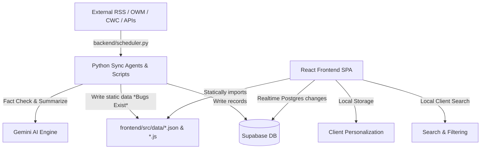

# Telangana.Live vs. Google News: Comprehensive Differential Analysis & Monetization Strategy

This report provides a detailed, codebase-driven comparison of **Telangana.Live** (a localized civic intelligence portal for Telangana, India) against the industry benchmark **Google News**. It synthesizes current implementations, exposes critical path-related data bugs, maps visual design paradigms, and integrates a high-performance **SEO and Ads Monetization Strategy** to outline the path toward a production-grade, sustainable civic portal.

---

## 1. Executive Summary & Architectural Overview

While **Google News** is a global-scale news aggregator powered by server-side machine learning recommendation engines, real-time web crawlers, and semantic search, **Telangana.Live** is designed as a lightweight, hyper-local civic portal. 

Telangana.Live utilizes a decoupled **Hybrid Sync** model:
*   **Backend Agents & Scrapers**: Python scripts (orchestrated via `backend/scheduler.py`) scrape local RSS feeds, pull rates/commodities, fact-check stories using Gemini 1.5-flash, and dump the processed results into static files (JSON/JS) or database records in Supabase.
*   **Frontend Web App**: A Vite/React TypeScript single-page application (SPA) configured to consume these static data files, using client-side context state (`frontend/src/context/AppContext.jsx`) to handle user personalization, and interacting with Supabase for real-time town-square reporting.

### System Data Flow Topology


---

## 2. UI/UX Visual Analysis: Material Design vs. Liquid Glass

The visual language of Telangana.Live deviates sharply from Google News's dense, utility-first layout in favor of an experimental, high-contrast dark glass system.

### Comparison Matrix: Visual Systems

| Design Dimension | Google News Benchmark | Telangana.Live Current Implementation |
| :--- | :--- | :--- |
| **Design Language** | **Material Design 3 (Material You)**. Neutral light/dark surfaces, explicit card outlines, low-contrast shadows, rounded corners. Content-first hierarchy. | **Liquid Glass (Glassmorphism)**. Translucent layers, intensive backdrop-blur, thin glowing borders, and neon indicators. |
| **Color Palette** | White/light-gray backgrounds (`#FFFFFF`, `#F8F9FA`) with high-contrast text. Secondary highlights in Material blue. | Deep slate-dark background (`#0F172A`) with high-saturation civic colors: Telangana Green (`#00A86B`), Heritage Gold (`#D4AF37`), and Red Alerts (`#CC0000`). |
| **Typography** | Google Sans / Roboto. Highly readable, standardized sans-serif weights optimized for scanning dense text. | Custom heading fonts with bold italic styles (`font-heading`, `font-black`, `tracking-tighter`). Inter fallback. |
| **Layout Density** | Highly dense grid with multiple columns: top stories, local news, and specialized widgets (Weather, Stocks). | Single-column scrollable cards on mobile, side-navigation bar, and floating widgets (Reservoirs, Rates, Weather) interspersed. |
| **Responsiveness** | Side navigation rail on desktop, bottom navigation bar on mobile. Seamless card resizing. | Uses custom responsive classes. However, CSS files (`NewsPage.css`) and glassmorphic panels have high rendering overhead on low-end mobile CPUs. |
| **Accessibility (WCAG)** | Strictly AA/AAA compliant. High contrast ratios, native text scaling, robust screen-reader support. | **Poor Contrast**. White text on transparent, blur-heavy backdrops often drops below a 4.5:1 ratio under ambient light. |

---

## 3. Pillar-by-Pillar Differential Analysis

### Pillar 1: Core Feed & Personalization
Google News uses complex server-side collaborative filtering and location-based ML vectors to rank headlines. Telangana.Live relies entirely on client-side sorting of static datasets.

*   **District Onboarding UI [Implemented]**: Users are presented with a district prompt (`frontend/src/components/DistrictOnboarding.jsx`) saved to `localStorage` under the key `tg-district`.
*   **Follow Logic [Implemented]**: Users can "follow" categories (e.g. Politics, Transit) or districts (e.g. Rangareddy). Preferences are stored locally via `frontend/src/context/AppContext.jsx`.
*   **Client-Side Headline Sorting [Implemented]**: `HomePage.jsx` sorts items by boosting followed categories/regions to the top before applying chronological sorting.
*   **Personalized Briefing Engine [Missing]**: No equivalent to Google's "For You" briefing.
*   **Server-Side Profiles [Missing]**: User settings are locked in browser `localStorage`. Logging in or syncing settings across devices is unbuilt.
*   **District News Render Gap [Broken]**: The home page computes `myDistrictNews` based on the user's selected onboarding district but **never renders it** in the UI, discarding the computed array.

---

### Pillar 2: Category Depth & Coverage
Telangana.Live offers specialized civic cards (reservoirs, mandi prices, transit status) that Google News lacks, but the data is largely mockups or stale due to script errors.

*   **Civic Financials Dashboard [Implemented]**: Gold rates (`goldRates.js`), fuel rates (`fuelPrices.js`), and essential mandi pulse commodities (`pulses.js`) are displayed with a 7-day historical trend.
*   **Real-Time Weather Scraper [Implemented]**: Script `scripts/weather_scraper.py` fetches data from OpenWeatherMap (OWM).
*   **Water Reservoirs & Levels Card [Implemented]**: Displays river inflows, outflows, and capacity in TMC (`water_levels.json`).
*   **Transit Flow Cards [Implemented]**: Displays Hyderabad Metro status and RTC bus congestion indices (`transit_status.json`).
*   **Live Transit API [Missing]**: The data in `backend/agents/transit_sync_agent.py` simulates congestion indices using `random.randint(70, 95)` rather than pulling from TSRTC Gamyam or Hyderabad Metro APIs.
*   **Live Reservoirs API [Missing]**: The data in `backend/agents/water_sync_agent.py` is hardcoded simulated data rather than scraping the Central Water Commission (CWC) or the Telangana Irrigation Dept portal.
*   **Weather Forecast Freshness [Broken]**: OWM script paths are misconfigured, resulting in stale weather info on the front-end.

---

### Pillar 3: Credibility, Verification & Fact-Checking
Google News relies on structured Schema.org markup (ClaimReview) from verified fact-checkers. Telangana.Live features a fact-checking agent in the backend, but uses mocked calculations on the frontend.

*   **Backend Fact-Checking Agent [Implemented]**: `backend/agents/fact_checker.py` uses Gemini 1.5-flash to scan headlines for clickbait, rating credibility from 0 to 100, and logging these to Supabase.
*   **Official Source Tagging [Implemented]**: News items with sources containing `'ghmc'` or `'govt'` dynamically display a pulsing red **"Official"** badge.
*   **Frontend Credibility Mocking [Broken/Fake]**: The frontend displays an "AI Confidence" badge, but instead of reading the database score, it calculates it on the fly using the **length of the article title**:
    `const aiConfidence = ai_summary ? Math.min(98, 75 + (title.length % 20)) : null;`
*   **Claim-Review Interface [Missing]**: No dashboard exists to show claims, checked verdicts, and reasoning links, which is standard for verified news benchmarks.

---

### Pillar 4: Real-Time Alerts & Notification Delivery
Google News delivers pushes via Firebase Cloud Messaging and emails. Telangana.Live has a Meta WhatsApp integration script but lacks a consumer registration portal.

*   **WhatsApp Daily Summary Scraper [Implemented]**: Script `scripts/whatsapp_bot.py` formats gold, fuel, and commodity rates and posts them via the Meta WhatsApp Cloud API.
*   **Emergency Alerts Banner [Implemented]**: `BreakingNewsBanner.jsx` polls `/data/alerts.json` and rolls a marquee for power, water, or weather emergencies.
*   **WhatsApp User Onboarding [Missing]**: No UI exists to allow users to input their phone numbers or opt-in to alerts; settings are loaded from a backend `.env` file for a single number.
*   **Web Push / Service Worker Notifications [Missing]**: The service worker is never registered in the app shell, preventing mobile pushes.
*   **Email Alerts / Newsletters [Missing]**: No mailing list or subscription architecture exists.

---

### Pillar 5: UX, Performance, SEO & Offline Capabilities
Google News is a highly search-engine-optimized, lightning-fast PWA with fully cached offline support. Telangana.Live is configured for PWA on paper, but lacks registration and caching.

*   **SEO Meta Insertion [Implemented]**: `ContentGenerator` writes metadata (descriptions and keywords) into database records.
*   **Client-Side Search [Implemented]**: `SearchPage.jsx` filters pre-fetched news, schemes, and services locally.
*   **PWA Service Worker Registration [Broken]**: The app includes `sw.js` in `public/public/sw.js` but never registers it using `navigator.serviceWorker.register()`. It is completely non-functional.
*   **Offline Caching [Missing]**: The service worker's fetch listener is a pass-through fetch shim that contains no caching logic.
*   **App Manifest Registration [Broken]**: The manifest file is located at `public/public/manifest.json` but is never linked in `index.html` via `<link rel="manifest">`.

---

## 4. Monetization & SEO Architecture Gaps

Monetizing hyper-local civic portals requires a delicate balance between revenue generation and performance preservation (avoiding layout shifts and third-party script bloat). Currently, Telangana.Live has zero monetization or technical SEO pathways implemented in the client code.

### A. Programmatic Ads Placement & CLS Prevention
Dynamic ad networks (Google AdSense, Ad Manager, Bing Ads) must be placed strategically to avoid disrupting the reader's flow.

#### Placement Specifications:
1.  **Sticky Header/Footer Banners**: Set up floating banners (Mobile: `320x50` floating above the `BottomNav` with `z-index: 40`; Desktop: `728x90` on `TopNav`). Include a clear dismiss button.
2.  **In-Feed Native Ads**: Programmatically inject an ad card every 6th item in the news grid (`NewsListingPage.jsx`). The cards should use dark backdrops matching the glassmorphic news card theme.
3.  **Sidebar Banners**: Placed on `xl`+ screens in the sticky `RightSidebar` below daily rates widgets.
4.  **Multiplex / Related Content**: Placed below the single article views in `ArticleModal.jsx` to direct readers to external partner sponsors.

#### CLS Prevention Technique:
Dynamic ad loading triggers Cumulative Layout Shift (CLS), which lowers search index rankings. To prevent this, all ad slots must be wrapped in containers with explicit aspect ratios and skeleton loaders:

```jsx
// frontend/src/components/ProgrammaticAd.jsx
import React, { useEffect, useState } from 'react';

export default function ProgrammaticAd({ slotId, format = 'auto', className = '' }) {
  const [adLoaded, setAdLoaded] = useState(false);

  useEffect(() => {
    try {
      (window.adsbygoogle = window.adsbygoogle || []).push({});
      setAdLoaded(true);
    } catch (e) {
      console.error("AdSense script not loaded yet or blocked:", e);
    }
  }, []);

  return (
    <div className={`ad-container relative bg-[#090b0d]/50 border border-white/5 rounded-2xl overflow-hidden min-h-[250px] flex items-center justify-center ${className}`}>
      {!adLoaded && (
        <div className="absolute inset-0 flex flex-col items-center justify-center space-y-2 animate-pulse bg-white/5">
          <div className="w-10 h-10 rounded-full border-2 border-telangana-green/20 border-t-telangana-green animate-spin"></div>
          <span className="text-[9px] text-text-muted font-bold tracking-wider uppercase">Sponsored Ad</span>
        </div>
      )}
      <ins className="adsbygoogle"
           style={{ display: 'block' }}
           data-ad-client="ca-pub-XXXXXXXXXXXXXXXX"
           data-ad-slot={slotId}
           data-ad-format={format}
           data-full-width-responsive="true"></ins>
    </div>
  );
}
```

### B. Facebook Instant Articles & Interstitial Capping
*   **Instant Articles (FBIA)**: Hyderabad news experiences massive viral surges from social referrals (WhatsApp, Facebook Groups). The backend lacks a dedicated RSS XML feed at `/api/feeds/instant-articles` outputting the required FBIA HTML tags with embed placement IDs.
*   **GPT Web Interstitials**: To monetize mobile web views when transitioning from social referrers to articles, Google Publisher Tag interstitials should be used.
*   **Urgency Guard Exclusion**: A strict capping system is required. Interstitials must be capped at **1 per user per 30 minutes** and **never** triggered when users are visiting critical routes, such as:
    *   `/emergency` (`EmergencyContactsPage.jsx`)
    *   `/health/basthi-dawakhana` (`HealthLandingPage.jsx`)
    *   `/weather` (`WeatherForecastPage.jsx`)

### C. Local Directory Sponsorship Models
Instead of generic display ads, Telangana.Live is uniquely positioned to offer high-margin local listings.
*   **Sponsored Jobs Card**: Modify `JobBoardPage.jsx` and `/data/jobsData.js` to support gold-bordered sponsored vacancies for local companies, fetching records from Supabase where `is_sponsored: true`.
*   **SubRegion Spotlight**: Enhance the `Partner Spotlight` section on `SubRegionPage.jsx` (`/region/:region`). Allow local businesses (e.g. IT coworking spaces, schools, real estate brokers) to buy visual banners.
*   **Promoted Services**: The legal and medical services directory in `SearchPage.jsx` must support promoted sorting:
    `listings.sort((a, b) => (b.is_promoted - a.is_promoted) || (b.rating - a.rating));`
*   **Mandi Price Ads**: Inject sponsor hooks into the agricultural index on `DailyRatesDashboard.jsx`: *"Mandi prices updated daily. Sponsored by AgriTech Telangana. [Check loans ↗]"*.

### D. Dynamic Schema Markup (JSON-LD)
Search engine bots (Google News/Discover) require semantic data tags. The React app must dynamically inject JSON-LD blocks depending on the active page:
1.  **NewsArticle Schema**: Injected when viewing details inside `ArticleModal.jsx` (specifying article author, publication date, title, and media logo).
2.  **LiveBlogPosting Schema**: Injected on election pages, monsoon/emergency alert banners, or live local blogs.
3.  **LocalBusiness / CivicStructure Schema**: Injected into the Basthi Dawakhana directory list items.

---

## 5. Critical Codebase Bugs & Gaps

During analysis, several major bugs and pathing discrepancies were identified in the data synchronisation workflow:

### Bug A: The Double-`src` Output Directory Bug
The sync agents in the backend write files into a non-existent `frontend/src/src/data/` path instead of the correct `frontend/src/data/` path:
*   **Affects**: `backend/agents/news_sync_agent.py` (Line 13), `price_sync_agent.py` (Line 12), `transit_sync_agent.py` (Line 13), `water_sync_agent.py` (Line 12)
*   **Result**: Scraped data updates are dumped into a dead subfolder. The frontend reads from the root `src/data/` folder, displaying stale, outdated information.

### Bug B: Weather Scraper Path Discrepancy
*   **File**: `scripts/weather_scraper.py` (Line 12) and `backend/scripts/scripts/weather_scraper.py` (Line 18)
*   **Code**: `DATA = os.path.join(os.path.dirname(__file__), "..", "src", "data")`
*   **Result**: The scrapers write to a root level `src/data/` or a backend folder instead of `frontend/src/data/weatherData.js`. The weather components (`WeatherCard`, `WeatherForecastPage`) read from `frontend/src/data/weatherData.js`, so the data remains static and un-updated.

### Bug C: `AIPulsePage.jsx` Frontend Render Crash
*   **File**: `frontend/src/pages/AIPulsePage.jsx` (Lines 35-37, 85)
*   **Code**: Iterates and references `aiBriefingData.executiveBrief`, `aiBriefingData.deprecations`, and `aiBriefingData.comparisonStats`.
*   **Data File**: `frontend/src/data/aiBriefingData.js` only exports `export const aiBriefingData = { "updatedAt": "...", "items": [...] }`.
*   **Result**: Because `executiveBrief`, `deprecations`, and `comparisonStats` are undefined, the AI Pulse page crashes immediately upon loading with a JavaScript TypeError.

### Bug D: Unused Client-side RSS Parser
*   **File**: `frontend/src/services/newsService.js` and `frontend/src/pages/NewsPage.jsx`
*   **Result**: The app contains a fully written browser-side RSS fetcher and XML parser (`rssParser.js`), but it is completely bypassed because `/news` is mapped to `NewsListingPage.jsx`, which imports the static `news.json` file.

### Bug E: Custom WhatsApp Share Parameter Mismatch
*   **File**: `frontend/src/components/NewsCard.jsx` (Line 147) passing to `frontend/src/components/ShareWhatsApp.jsx`
*   **Code**: `ShareWhatsApp` is called with custom properties: `<ShareWhatsApp type="custom" customTitle={title} customLink={link} />`.
*   **Result**: `ShareWhatsApp.jsx` only accepts `{ type, data }`. The custom properties are ignored, and sharing any news article results in the generic fallback string `"Get live updates on telangana.live"`, losing the headline and link.

---

## 6. Technical Remediation Roadmap

To resolve these architectural flaws and unlock revenue capabilities, the following implementation plan is proposed:

### Phase 1: Immediate Structural Hotfixes
1.  **Resolve Data Paths**: Fix the double `src` bug in all Python sync agents, shifting output directories to `frontend/src/data/`.
2.  **Fix AI Pulse Schema**: Extend `sync_ai_pulse` to generate the mock `executiveBrief`, `deprecations`, and `comparisonStats` keys to resolve the page crash.
3.  **Repair WhatsApp Sharing**: Update `ShareWhatsApp.jsx` to receive and embed `customTitle` and `customLink` into the caption instead of hardcoding fallback strings.

### Phase 2: SEO, Caching & Performance
1.  **Register PWA Manifest & SW**: Link `manifest.json` in `index.html` and add dynamic caching logic to `sw.js` (network-first, falling back to cache).
2.  **Defer Ads & Fonts Scripts**: Defer the AdSense script injection until after the first user gesture to maintain high Core Web Vitals (FCP/LCP). Serve local Telugu fonts with `font-display: swap`.
3.  **Dynamic SEO Schema Injection**: Introduce standard JSON-LD wrappers for `NewsArticle` in `ArticleModal.jsx` and `LocalBusiness` in Basthi Dawakhana components.
4.  **Bilingual Keywords Integration**: Align titles and meta descriptions using the bilingual keyword matrix (Telugu script + English query routing):
    *   Rythu Bandhu Check: `Rythu Bandhu Status 2026: రైతు బంధు స్టేటస్ - Telangana.Live`

### Phase 3: Monetization Launch
1.  **Integrate `ProgrammaticAd.jsx`**: Place sticky mobile/desktop anchor containers and grid placement cards in `NewsListingPage.jsx`.
2.  **Implement Sponsored Tiers in Database**: Add `is_sponsored` and `is_promoted` fields to the jobs and services directories in Supabase. Implement sorting logic on the client.
3.  **Exclusion Gates**: Set up a custom wrapper around the GPT interstitial engine that blocks ads entirely if the active route is `/emergency`, `/weather`, or `/health/basthi-dawakhana`.
